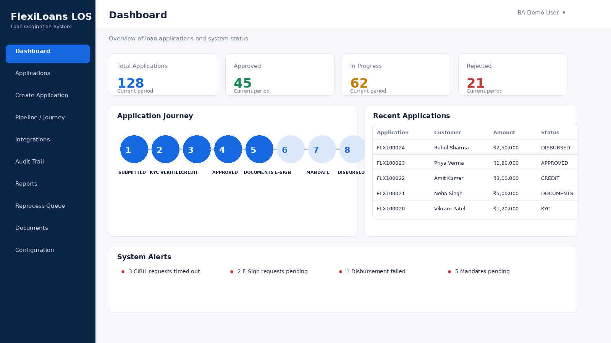
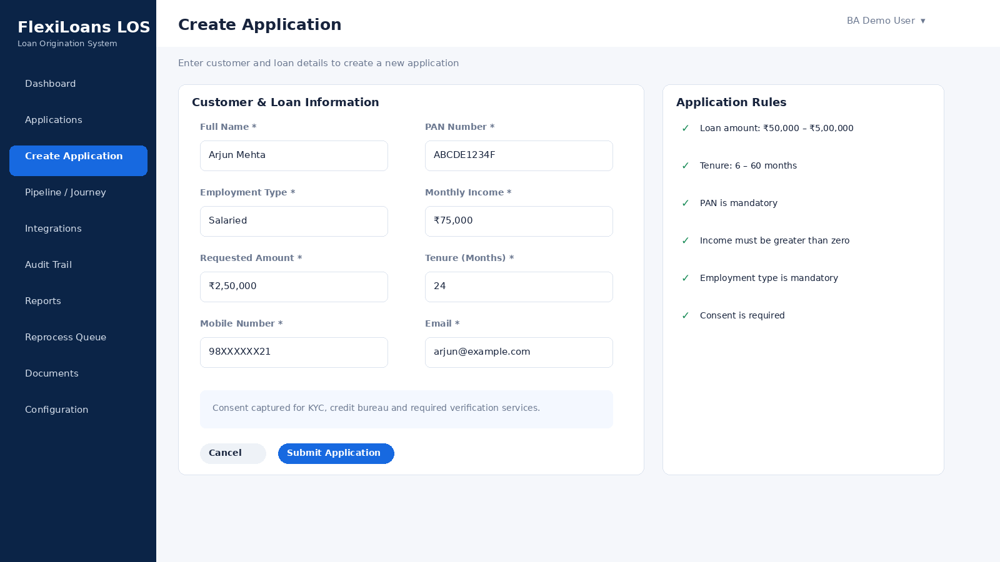
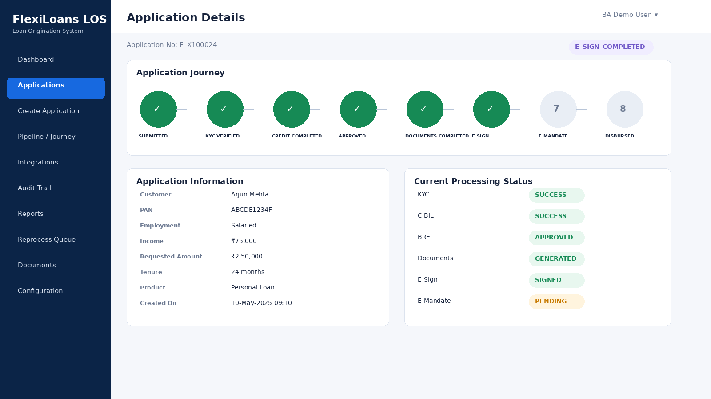
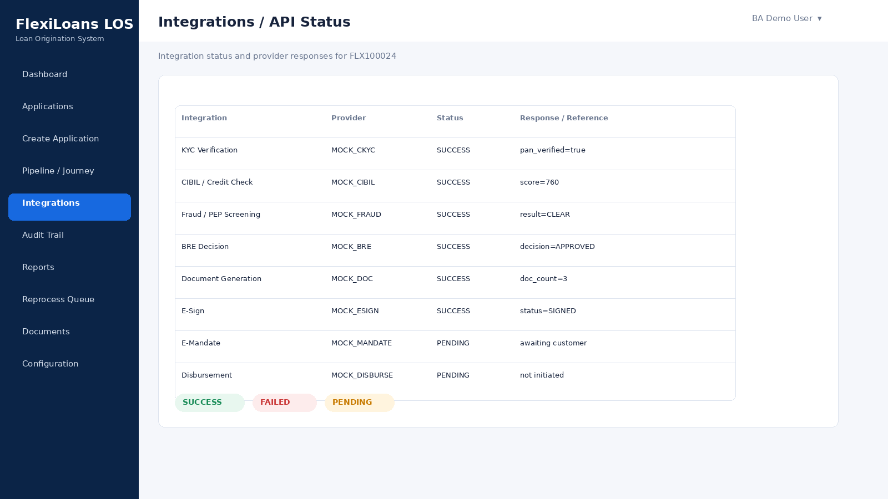
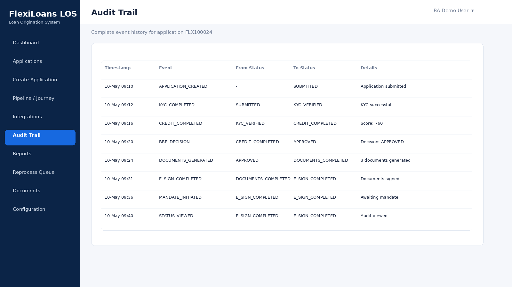
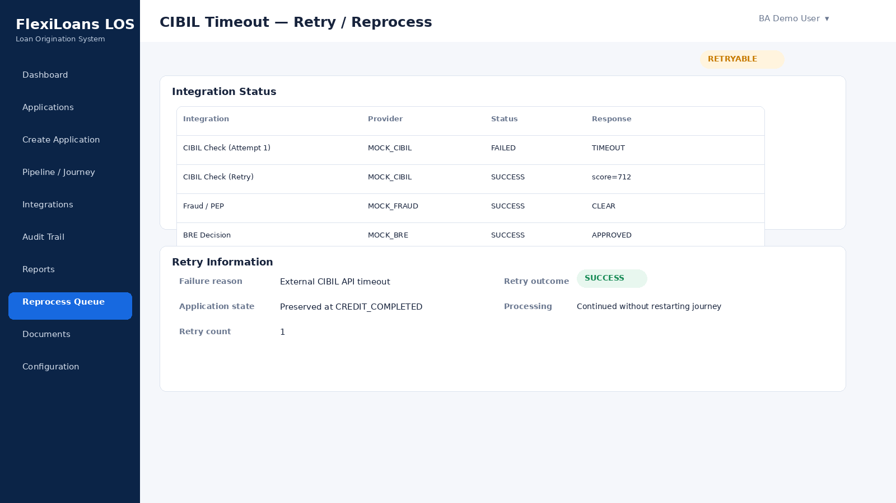
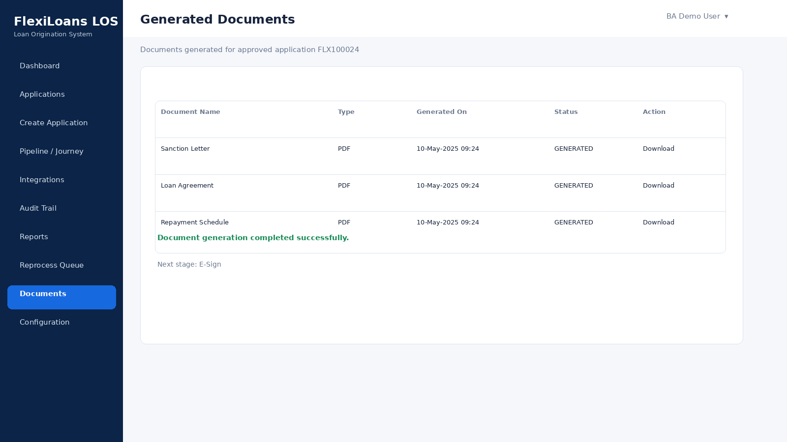
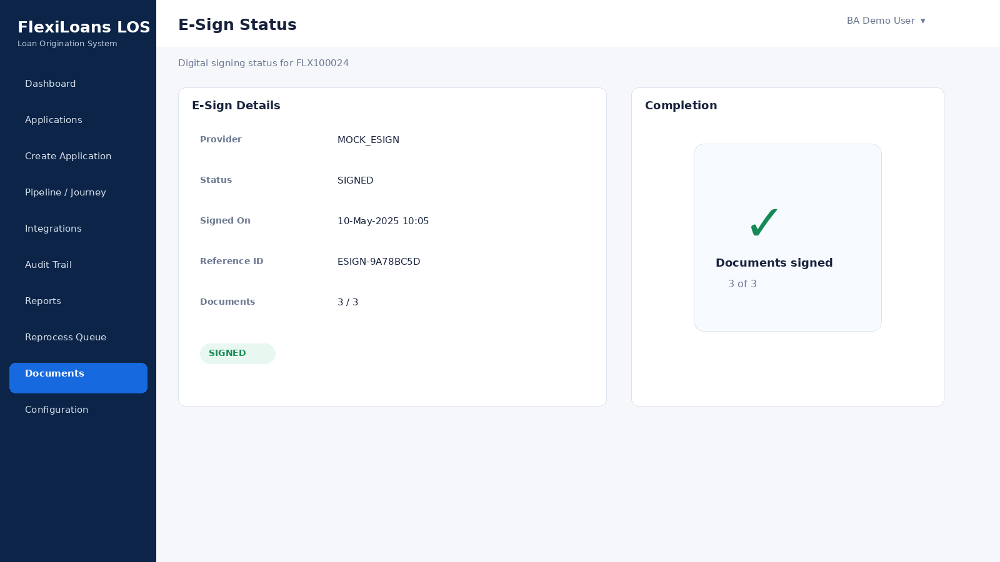
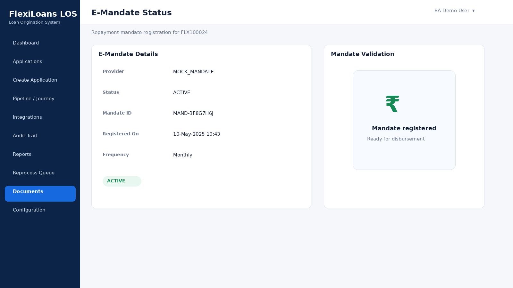
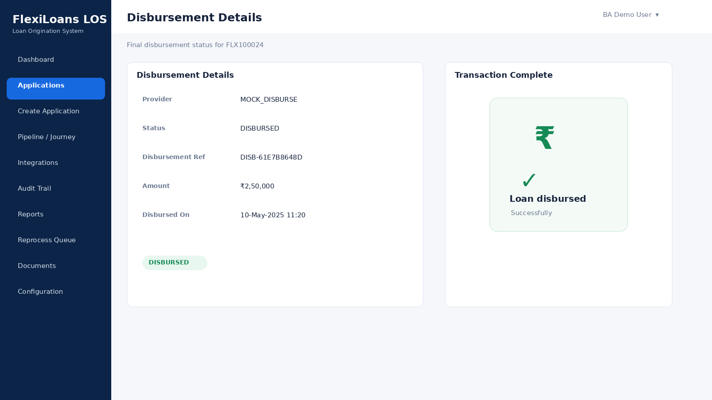

# FlexiLoans LOS — Technical BA Portfolio Project

A runnable, educational **Loan Origination System (LOS)** prototype demonstrating how a Business Analyst can translate a digital personal-loan requirement into an implementable end-to-end technology solution.

> **Disclaimer:** This is an educational/portfolio prototype. It does not connect to real CIBIL, KYC, banking, payment, or lending APIs. All integrations and rules are mock/illustrative.

---

## 1. Project Overview

FlexiLoans is a Digital Loan Origination System (LOS) prototype designed to demonstrate an end-to-end digital personal-loan journey.

The solution demonstrates how a Business Analyst can translate business requirements into:

- Business processes
- Functional requirements
- Non-functional requirements
- Business rules
- API/integration requirements
- Data mappings
- Application state transitions
- User stories
- Acceptance criteria
- Use cases
- Exception handling
- Retry/reprocess behaviour
- Audit trail and traceability
- UAT scenarios

The prototype simulates a digital lending journey covering:

- Customer onboarding
- Application creation
- Application lifecycle/state management
- KYC verification
- CIBIL/credit assessment
- Fraud/PEP screening
- Business Rule Engine (BRE) decisioning
- Document generation
- E-Sign
- E-Mandate
- Loan disbursement
- Audit trail
- Integration monitoring
- Exception handling
- Retry/reprocess simulation
- UAT scenarios
- BA interview view

The primary BA framework demonstrated is:

**Requirement → Process → Rule → API → Data Mapping → Exception → UAT → Audit**

---

## 2. Business Objective

The primary objective is to demonstrate a digital personal-loan journey from application creation through final disbursement while ensuring that mandatory validations, business rules, integrations, exception scenarios and auditability are clearly defined.

The solution is intended to demonstrate:

- Digital application processing
- Reduced manual intervention
- Automated validation
- Credit assessment
- Rule-based decisioning
- Digital documentation
- Electronic signing
- Electronic repayment mandate
- Automated disbursement
- Operational visibility
- Exception handling
- End-to-end traceability

---

## 3. My Role as Business Analyst

As the Business Analyst for the project, my primary responsibility was to bridge the gap between business stakeholders and the technology team.

My responsibilities included:

- Requirement elicitation
- Stakeholder discussions
- Understanding business objectives
- AS-IS and TO-BE process analysis
- Business process modelling
- BRD preparation
- FRD preparation
- User-story creation
- Acceptance criteria definition
- Business-rule definition
- API/integration requirement analysis
- Request/response analysis
- Data-field mapping
- Validation-rule definition
- Exception scenario identification
- Application lifecycle/state-transition analysis
- UAT scenario preparation
- Test-case review
- Development coordination
- QA coordination
- Defect clarification
- Requirement traceability
- Audit and operational requirements

A key focus of the BA role was translating business requirements into implementable and testable system behaviour.

The overall BA approach demonstrated in the project is:

Business Requirement  
↓  
Business Process  
↓  
Functional Requirement  
↓  
Business Rule  
↓  
User Story  
↓  
Acceptance Criteria  
↓  
API / Integration  
↓  
Data Mapping  
↓  
Exception Handling  
↓  
UAT  
↓  
Audit / Traceability

---

## 4. End-to-End Loan Journey

The FlexiLoans LOS follows the following end-to-end digital personal-loan journey:

**Application → KYC → CIBIL → BRE → Generate Documents → E-Sign → E-Mandate → Disburse**

Each stage represents a defined business milestone with associated:

- Validations
- Business rules
- API integrations
- Data mappings
- Application state transitions
- Exception scenarios
- Audit events

### Stage Overview

| Stage | Business Purpose |
|---|---|
| Application | Capture customer and loan information and create the application |
| KYC | Verify customer identity and required KYC information |
| CIBIL | Obtain credit-bureau information for credit assessment |
| BRE | Evaluate eligibility and lending rules |
| Generate Documents | Generate applicable loan documents after approval |
| E-Sign | Digitally sign the required loan documents |
| E-Mandate | Register the repayment mandate |
| Disburse | Disburse the approved loan amount after mandatory conditions are satisfied |

---

## 5. Application Lifecycle

The application progresses through controlled lifecycle states based on the successful completion of each stage.

**SUBMITTED → KYC_VERIFIED → CREDIT_COMPLETED → APPROVED → DOCUMENTS_COMPLETED → E_SIGN_COMPLETED → MANDATE_COMPLETED → DISBURSED**

| State | Description |
|---|---|
| SUBMITTED | Customer application successfully created |
| KYC_VERIFIED | KYC verification successfully completed |
| CREDIT_COMPLETED | CIBIL/credit assessment successfully completed |
| APPROVED | BRE decision resulted in approval |
| DOCUMENTS_COMPLETED | Required loan documents successfully generated |
| E_SIGN_COMPLETED | Required documents successfully digitally signed |
| MANDATE_COMPLETED | E-Mandate successfully registered |
| DISBURSED | Loan successfully disbursed |

The LOS controls progression between states and prevents an application from moving forward when mandatory prerequisites have not been satisfied.

---

## 6. Business Process

### 6.1 Application Creation

The customer provides the required information to initiate a personal-loan application.

Customer information includes:

- Name
- PAN
- Employment type
- Monthly income
- Requested loan amount
- Loan tenure

The system validates mandatory information and creates the application.

The application starts in:

**SUBMITTED**

A unique application number is generated.

### 6.2 KYC Verification

The KYC stage validates the customer's identity and required KYC information.

The prototype represents KYC through a mock integration.

Example response:

    {
      "pan_verified": true,
      "address_verified": true,
      "provider": "MOCK_CKYC"
    }

Successful transition:

**SUBMITTED → KYC_VERIFIED**

### Business Rule

KYC must be successfully completed before credit processing can proceed.

### 6.3 CIBIL / Credit Bureau

After successful KYC, the LOS invokes the credit-bureau integration.

The mock CIBIL service returns credit information.

Example:

    {
      "bureau": "MOCK_CIBIL",
      "credit_score": 760,
      "bureau_status": "SUCCESS"
    }

The credit result is associated with the application.

### Business Rule

Required credit information must be successfully obtained before BRE decisioning.

### 6.4 Fraud / PEP Screening

The prototype also represents fraud/PEP screening as a supporting risk-validation activity.

Example outcome:

**CLEAR**

An acceptable risk status allows the application to continue.

An unacceptable result may prevent further processing depending on the configured business rules.

### 6.5 BRE Decisioning

The Business Rules Engine (BRE) acts as the decisioning layer.

The BRE evaluates configured eligibility criteria using information such as:

- Credit score
- Requested loan amount
- Product limits
- Employment information
- KYC status
- Risk-screening results
- Other configured eligibility parameters

Illustrative rule:

**IF credit_score >= 750 AND requested_amount <= configured_product_limit THEN APPROVE ELSE REJECT**

Example transition:

**CREDIT_COMPLETED → BRE_DECISION → APPROVED**

The actual production rules would be client-specific and configurable.

### 6.6 Generate Documents

After approval, the prototype generates mock loan documents.

Examples include:

- Sanction Letter
- Loan Agreement
- Repayment Schedule

Transition:

**APPROVED → DOCUMENTS_COMPLETED**

Document generation should be completed before the application proceeds to digital execution.

### 6.7 E-Sign

The generated loan documents are sent to the mock electronic-signature service.

Example response:

    {
      "signature_status": "SIGNED",
      "provider": "MOCK_ESIGN"
    }

Successful signing results in:

**DOCUMENTS_COMPLETED → E_SIGN_COMPLETED**

### Business Rule

Required loan documents must be digitally signed before the application can proceed to final fulfilment.

### 6.8 E-Mandate

The customer registers the repayment mandate.

The prototype represents this through a mock mandate integration.

Example response:

    {
      "mandate_status": "ACTIVE",
      "provider": "MOCK_MANDATE"
    }

Successful transition:

**E_SIGN_COMPLETED → MANDATE_COMPLETED**

### Business Rule

The required repayment mandate must be successfully registered before disbursement.

### 6.9 Disbursement

Once all mandatory fulfilment conditions have been satisfied, the LOS invokes the mock disbursement integration.

Example response:

    {
      "reference": "DISB-61E7B8648D",
      "amount": 250000
    }

Successful transition:

**MANDATE_COMPLETED → DISBURSED**

The final application state is:

**DISBURSED**

---

## 7. API / Integration Mapping

The LOS follows an API-driven integration approach.

| Business Requirement | Integration | Purpose |
|---|---|---|
| Verify identity | KYC API | Identity/KYC verification |
| Obtain credit information | CIBIL API | Credit assessment |
| Screen risk | Fraud/PEP API | Risk screening |
| Determine eligibility | BRE | Credit decisioning |
| Generate documents | Document Service | Loan documentation |
| Digitally execute agreement | E-Sign API | Digital signature |
| Register repayment mandate | E-Mandate API | Mandate registration |
| Disburse loan | Disbursement API | Loan payout |

### Possible Supporting APIs

Depending on the actual client implementation, a digital LOS may also integrate with:

- PAN verification
- Customer deduplication
- OTP generation/validation
- Consent management
- CKYC
- DigiLocker
- Address verification
- Face matching
- Fraud screening
- PEP screening
- AML/watchlist screening
- Employment verification
- Income verification
- EPFO
- Udyam
- GST
- Bank account verification
- Penny-drop verification
- Document upload
- Document retrieval
- SMS notification
- Email notification
- WhatsApp notification
- Application status
- Disbursement status
- Reconciliation
- Audit/event APIs

These are included as possible integration areas for a digital lending architecture and do not imply that every provider or API was used in this prototype.

---

## 8. API Requirement Areas

For each integration, the BA should define and document:

### Request

- API endpoint
- HTTP method
- Headers
- Authentication
- Path parameters
- Query parameters
- Request body
- Mandatory fields
- Optional fields
- Data types

### Response

- HTTP status
- Business status
- Response fields
- Provider reference
- Error code
- Error message

### Integration Behaviour

- Timeout
- Retry behaviour
- Retry limits
- Idempotency
- Duplicate request handling
- Duplicate response handling
- Webhook/polling behaviour
- Status mapping
- Reconciliation
- Audit requirements

### Security

- HTTPS/TLS
- Authentication
- Authorization
- Credential/secret management
- PII protection
- Logging and masking

### Monitoring

- API latency
- Success rate
- Failure rate
- Timeout rate
- Provider availability
- Alerts
- Integration health

---

## 9. Webhook vs Polling

Some external integrations may operate asynchronously.

### Polling

With polling, the LOS periodically requests the status of an external transaction.

Example flow:

**LOS → Provider Status API → Processing → LOS checks status again → Final Status**

### Webhook

With a webhook, the external provider sends a notification to the LOS when the transaction status changes.

Example flow:

**LOS → Initiate Transaction → External Provider → Status Changes → Provider Webhook → LOS**

### BA Considerations

For asynchronous integrations, requirements may include:

- Webhook authentication
- Event validation
- Duplicate-event handling
- Idempotency
- Retry mechanism
- Event ordering
- Timeout handling
- Status mapping
- Reconciliation
- Audit logging

The appropriate mechanism depends on the capabilities of the external provider and the business requirements.

---

## 10. Business Rules

Representative business rules include:

1. Mandatory application information must be validated.
2. KYC must be successfully completed before credit processing.
3. Credit processing must complete before BRE decisioning.
4. Credit score must satisfy the configured eligibility threshold.
5. Requested loan amount must remain within the configured product limit.
6. Fraud/PEP screening must return an acceptable status.
7. Approval is required before document generation.
8. Required documents must be successfully generated.
9. Required documents must be digitally signed.
10. E-Mandate must be active before disbursement.
11. Disbursement can occur only after mandatory prerequisites are satisfied.
12. Technical failures must be distinguished from business rejection.
13. Retryable failures should support controlled reprocessing.
14. Important state transitions must be recorded in the audit trail.
15. Duplicate requests must not create duplicate financial transactions.

---

## 11. Functional Requirements

### Application

- System shall allow creation of a loan application.
- System shall validate mandatory fields.
- System shall generate a unique application number.
- System shall maintain application status.
- System shall store customer and loan information.

### KYC

- System shall initiate KYC verification.
- System shall receive KYC response.
- System shall update KYC status.
- System shall prevent progression when mandatory KYC fails.

### CIBIL

- System shall initiate credit-bureau processing.
- System shall receive credit information.
- System shall store credit result.
- System shall handle timeout and retryable failures.

### BRE

- System shall submit required information for decisioning.
- System shall evaluate configured eligibility rules.
- System shall return a decision.
- System shall record decision-related information.

### Documents

- System shall generate required loan documents.
- System shall associate documents with the application.
- System shall handle document-generation failure.

### E-Sign

- System shall initiate the signing process.
- System shall receive signing status.
- System shall update application state after successful signing.

### E-Mandate

- System shall initiate mandate registration.
- System shall receive mandate status.
- System shall prevent disbursement if the required mandate is not active.

### Disbursement

- System shall validate disbursement prerequisites.
- System shall initiate disbursement.
- System shall record transaction/reference information.
- System shall handle disbursement failures.
- System shall prevent duplicate financial transactions.

---

## 12. Non-Functional Requirements

### Performance

- API response-time requirements
- External integration latency monitoring
- Application processing performance

### Availability

- LOS availability
- Critical integration availability
- Recovery expectations

### Scalability

- Ability to support expected application volumes
- Ability to scale integration processing

### Security

- Secure API communication
- Authentication and authorization
- Protection of customer information
- Secure credential management
- PII masking in logs

### Reliability

- Controlled retry mechanisms
- Failure isolation
- State preservation
- Duplicate transaction prevention

### Auditability

- Application event logging
- Integration event logging
- State-transition traceability

### Maintainability

- Maintainable business rules
- Clear API contracts
- Modular integration design
- Maintainable code structure

### Observability

- Logging
- Metrics
- Error monitoring
- Integration monitoring
- Alerts

---

## 13. Exception Handling

The LOS distinguishes between business failures and technical/integration failures.

### Business Failure

Examples:

- Customer fails eligibility criteria
- Credit criteria not satisfied
- KYC verification unsuccessful
- Fraud/risk check not acceptable
- E-Mandate not completed

A business failure may result in rejection or prevention of further processing.

### Technical Failure

Examples:

- API timeout
- Provider unavailable
- Network failure
- Invalid downstream response
- HTTP 5xx response

A technical failure should not automatically be treated as a business rejection.

Depending on the error classification, the application may:

1. Preserve its current business state
2. Record the integration failure
3. Mark the event as retryable
4. Allow retry/reprocessing
5. Continue the journey after successful recovery

---

## 14. CIBIL Timeout — Retry / Reprocess Scenario

A key BA/system-design scenario demonstrated in the prototype is an external CIBIL integration failure.

Flow:

**CIBIL Timeout → Integration Failure Recorded → Application State Preserved → Failure Marked Retryable → Retry/Reprocess → CIBIL Success → Continue Processing**

Example integration result:

    {
      "error": "TIMEOUT",
      "retryable": true
    }

The application does not restart from the beginning.

This demonstrates separation of:

**Application State**

and

**Integration State**

This is important because an external provider failure should not unnecessarily reset the customer's application journey.

---

## 15. Idempotency

Idempotency ensures that repeating the same transaction request does not create duplicate business or financial transactions.

This is particularly important for:

- E-Mandate registration
- Disbursement
- Payment-related transactions
- Webhook/event processing

For example, if a disbursement request is retried because of a timeout, the LOS should identify the original transaction rather than creating a second disbursement.

Typical BA requirements may include:

- Unique transaction reference
- Idempotency key
- Duplicate-request validation
- Duplicate-event handling
- Transaction-status verification
- Reconciliation

---

## 16. Audit Trail

The LOS maintains an audit trail for major application transitions and integration events.

The audit record may capture:

- Timestamp
- Application reference
- Event type
- Previous status
- New status
- Processing details
- Reason
- Integration result
- Provider reference where applicable

Example:

**APPLICATION_CREATED → SUBMITTED**

**KYC_COMPLETED: SUBMITTED → KYC_VERIFIED**

**CREDIT_COMPLETED: KYC_VERIFIED → CREDIT_COMPLETED**

**BRE_DECISION: CREDIT_COMPLETED → APPROVED**

**DOCUMENTS_GENERATED: APPROVED → DOCUMENTS_COMPLETED**

**E_SIGN_COMPLETED: DOCUMENTS_COMPLETED → E_SIGN_COMPLETED**

**MANDATE_COMPLETED: E_SIGN_COMPLETED → MANDATE_COMPLETED**

**DISBURSEMENT_COMPLETED: MANDATE_COMPLETED → DISBURSED**

### Why Audit Trail is Important

The audit trail provides:

- End-to-end application traceability
- Visibility into state transitions
- Integration history
- Exception investigation
- Operational support
- UAT validation
- Compliance/support evidence

A useful interview explanation is:

> **Application Status tells us where the application is. Audit Trail tells us how the application got there.**

---

## 17. Operations / Integration View

The UI provides visibility into mock integration events.

Example:

**KYC | SUCCESS**

**CIBIL | SUCCESS**

**FRAUD_PEP | SUCCESS**

**E_SIGN | SUCCESS**

**E_MANDATE | SUCCESS**

**DISBURSEMENT | SUCCESS**

Example failure:

**CIBIL | FAILED | TIMEOUT | retryable=true**

This demonstrates how an operations user can identify integration failures and understand the appropriate next action.

---

## 18. BA Interview View

The application demonstrates the following BA framework:

**Requirement → Process → Business Rule → API → Data Mapping → Exception → UAT → Audit**

This demonstrates how a BA translates a business requirement into implementable system behaviour.

---

## 19. Business Requirements Demonstrated

### BR-01 — Digital Application

Customer can submit a personal-loan application digitally.

### BR-02 — KYC Validation

KYC must complete before credit processing.

### BR-03 — Credit Assessment

Credit information must be obtained before decisioning.

### BR-04 — Risk Screening

Fraud/PEP checks must return an acceptable status.

### BR-05 — Eligibility Decision

BRE evaluates configured eligibility rules.

### BR-06 — Documentation

Loan documents are generated after approval.

### BR-07 — Digital Agreement

E-Sign is required before final fulfilment.

### BR-08 — Repayment Mandate

E-Mandate must be active before disbursement.

### BR-09 — Disbursement

Loan is disbursed only after mandatory prerequisites are satisfied.

### BR-10 — Auditability

Major application and integration events are recorded.

### BR-11 — Exception Handling

Retryable technical failures should be identifiable and reprocessable.

### BR-12 — Traceability

The application journey should be traceable from initiation through final outcome.

---

## 20. User Stories

### User Story 1 — Application

**As a loan applicant,**

I want to submit my personal and loan information,

so that I can initiate a loan application digitally.

### User Story 2 — KYC

**As a loan applicant,**

I want my identity to be digitally verified,

so that I can proceed with my loan application.

### User Story 3 — Credit

**As the LOS,**

I want to obtain the customer's credit information,

so that the application can be evaluated for eligibility.

### User Story 4 — BRE

**As a business/credit user,**

I want applications evaluated against configured business rules,

so that loan decisions are consistent and automated.

### User Story 5 — Documents

**As an approved customer,**

I want my loan documents generated digitally,

so that I can complete the process without physical paperwork.

### User Story 6 — E-Sign

**As a loan applicant,**

I want to digitally sign my loan documents,

so that I can complete the agreement remotely.

### User Story 7 — E-Mandate

**As a loan applicant,**

I want to register my repayment mandate digitally,

so that future EMI repayments can be processed.

### User Story 8 — Disbursement

**As an approved customer,**

I want the approved loan amount to be disbursed,

so that I receive the loan amount after completing all mandatory requirements.

### User Story 9 — Exception Handling

**As an operations user,**

I want retryable integration failures to be identified,

so that failed transactions can be reprocessed.

### User Story 10 — Audit

**As an operations/compliance user,**

I want to view the application history,

so that I can understand how the application progressed.

---

## 21. Acceptance Criteria

### Application

**Given** valid mandatory customer and loan information,

**When** the customer submits the application,

**Then** the system should create the application,

**And** generate an application number,

**And** set the application to the appropriate initial state.

### KYC

**Given** an application in the appropriate state,

**When** KYC verification is successful,

**Then** the application should move to `KYC_VERIFIED`.

### CIBIL

**Given** successful KYC,

**When** the CIBIL request is successful,

**Then** the system should store the credit result,

**And** allow the application to proceed to decisioning.

### BRE

**Given** all required decision inputs,

**When** the BRE evaluates the application,

**Then** the configured eligibility rules should be applied,

**And** the appropriate decision should be returned,

**And** the decision should be auditable.

### Documents

**Given** an approved application,

**When** document generation is triggered,

**Then** the required documents should be generated,

**And** the application should progress appropriately.

### E-Sign

**Given** required documents are available,

**When** the customer successfully signs the documents,

**Then** the signing status should be recorded,

**And** the application should move to the next stage.

### E-Mandate

**Given** all required prior stages are completed,

**When** mandate registration succeeds,

**Then** the mandate status should be recorded as active,

**And** the application should be eligible for disbursement subject to other prerequisites.

### Disbursement

**Given** all mandatory fulfilment conditions are satisfied,

**When** disbursement is initiated,

**Then** the system should process the transaction,

**And** record the transaction reference,

**And** update the application to `DISBURSED`.

### CIBIL Timeout

**Given** an application waiting for a CIBIL response,

**When** the CIBIL API times out,

**Then** the system should record the integration failure,

**And** preserve the application state,

**And** identify the failure as retryable,

**And** allow retry/reprocessing,

**And** continue processing after successful recovery.

### Duplicate Processing

**Given** a transaction has already been processed,

**When** the same transaction is submitted again,

**Then** the system should prevent duplicate financial processing.

---

## 22. Use Cases

### UC-001 — Create Loan Application

**Actor:** Customer

**Objective:** Create a personal-loan application.

**Main Flow:**

1. Customer enters required information.
2. System validates mandatory fields.
3. System creates application.
4. System generates application number.
5. Application enters `SUBMITTED` state.

### UC-002 — Perform KYC

**Actor:** LOS / KYC Provider

**Objective:** Verify customer identity.

**Main Flow:**

1. LOS initiates KYC.
2. KYC provider processes request.
3. Provider returns response.
4. LOS records result.
5. Application moves to `KYC_VERIFIED`.

### UC-003 — Perform Credit Check

**Actor:** LOS / CIBIL

**Objective:** Obtain credit information.

**Main Flow:**

1. LOS sends credit request.
2. CIBIL processes request.
3. CIBIL returns response.
4. LOS stores result.
5. Application proceeds to decisioning.

### UC-004 — Execute BRE Decision

**Actor:** LOS / BRE

**Objective:** Evaluate eligibility.

**Main Flow:**

1. LOS prepares decision inputs.
2. BRE evaluates configured rules.
3. BRE returns decision.
4. LOS records decision.
5. Approved applications proceed to document generation.

### UC-005 — Generate Documents

**Actor:** LOS / Document Service

**Objective:** Generate loan documentation.

**Main Flow:**

1. LOS confirms approval.
2. Required loan data is sent to document service.
3. Documents are generated.
4. Documents are associated with the application.
5. Application proceeds to E-Sign.

### UC-006 — E-Sign

**Actor:** Customer / E-Sign Provider

**Objective:** Digitally execute loan documents.

**Main Flow:**

1. LOS initiates signing.
2. Customer completes signing.
3. Provider returns signing status.
4. LOS records signing result.
5. Application proceeds to E-Mandate.

### UC-007 — E-Mandate

**Actor:** Customer / Mandate Provider

**Objective:** Register repayment mandate.

**Main Flow:**

1. LOS initiates mandate.
2. Customer authorizes mandate.
3. Provider processes mandate.
4. Provider returns status.
5. LOS records mandate status.
6. Application proceeds to disbursement.

### UC-008 — Disbursement

**Actor:** LOS / Disbursement Provider

**Objective:** Disburse approved loan amount.

**Main Flow:**

1. LOS validates mandatory prerequisites.
2. Disbursement request is initiated.
3. Provider processes transaction.
4. Provider returns status/reference.
5. LOS records transaction.
6. Application moves to `DISBURSED`.

---

## 23. Data / Field Mapping

| UI Field | Backend Field | Purpose |
|---|---|---|
| Name | `name` | Customer name |
| PAN | `pan` | Customer identifier |
| Employment | `employment_type` | Employment category |
| Monthly Income | `income` | Income assessment |
| Requested Amount | `requested_amount` | Loan amount |
| Tenure | `tenure_months` | Loan tenure |

Integration outputs include:

- KYC verification
- CIBIL score
- Fraud/risk status
- BRE decision
- E-Sign status
- E-Mandate status
- Disbursement reference

---

## 24. UAT Scenarios

Representative UAT scenarios include:

### Positive Scenarios

- Successful application creation
- Successful KYC
- Successful CIBIL
- Successful BRE approval
- Successful document generation
- Successful E-Sign
- Successful E-Mandate
- Successful disbursement

### Validation Scenarios

- Missing mandatory fields
- Invalid customer information
- Invalid loan amount
- Invalid tenure
- Invalid application state

### Credit / Decisioning Scenarios

- Successful CIBIL response
- CIBIL rejection/failure
- CIBIL timeout
- BRE approval
- BRE rejection
- Missing BRE input

### Fulfilment Scenarios

- Document-generation failure
- E-Sign failure
- E-Mandate failure
- Disbursement failure

### Exception Scenarios

- API timeout
- Provider unavailable
- Retry/reprocess
- Duplicate request
- Duplicate webhook
- Unknown transaction status
- Reconciliation mismatch

### Audit Scenarios

- Application creation event recorded
- State transition recorded
- Integration event recorded
- Failure event recorded
- Retry/reprocess event recorded
- Final disbursement event recorded

---

## 25. Traceability Matrix Approach

The project demonstrates traceability between business requirements and implementation.

**Business Requirement → Functional Requirement → User Story → Acceptance Criteria → UAT Test Case → Application Behaviour → Audit Evidence**

Example:

**Digital Decisioning → BRE Functional Requirement → Decisioning User Story → BRE Acceptance Criteria → BRE UAT Scenario → Application Approval → Audit Event**

This demonstrates how a BA maintains requirement traceability throughout the delivery lifecycle.

---

## 26. Technical Architecture

The prototype follows an API-driven architecture.

### High-Level Architecture

**Customer / User**

↓

**Web UI — HTML / CSS / JavaScript**

↓

**FastAPI Backend**

↓

**Business Services / Application Lifecycle**

↓

**Business Rules / Integration Layer**

↓

**Mock External Services**

- KYC
- CIBIL
- Fraud/PEP
- BRE
- Document Service
- E-Sign
- E-Mandate
- Disbursement

↓

**SQLite Database**

The architecture demonstrates separation between:

- User interface
- Application/API layer
- Business logic
- Integration services
- Data persistence

---

## 27. Technology Stack

### Backend

- Python
- FastAPI
- Uvicorn

### Database

- SQLite

### Frontend

- HTML
- CSS
- JavaScript

### API

- REST APIs
- JSON

### Integration

- Mock KYC
- Mock CIBIL
- Mock Fraud/PEP
- Mock BRE
- Mock Document Service
- Mock E-Sign
- Mock E-Mandate
- Mock Disbursement

### Version Control

- Git
- GitHub

---

## 28. Project Structure

    flexiloans-los/
    │
    ├── app/
    │   ├── __init__.py
    │   ├── main.py
    │   ├── los.db
    │   └── static/
    │       └── index.html
    │
    ├── docs/
    ├── tests/
    ├── .gitignore
    ├── README.md
    └── requirements.txt

---

## 29. How to Run

Requires Python 3.10+.

### Windows

    python -m venv .venv
    .venv\Scripts\activate
    pip install -r requirements.txt
    uvicorn app.main:app --reload

### macOS/Linux

    python -m venv .venv
    source .venv/bin/activate
    pip install -r requirements.txt
    uvicorn app.main:app --reload

Open:

**http://127.0.0.1:8000**

API documentation:

**http://127.0.0.1:8000/docs**

---

## 30. Suggested Interview Demonstration

The recommended interview demonstration follows the actual application workflow:

1. Create an application.
2. Run KYC.
3. Run CIBIL.
4. Run BRE.
5. Generate documents.
6. Complete E-Sign.
7. Complete E-Mandate.
8. Disburse the loan.
9. Explain the application lifecycle.
10. Open the audit trail.
11. Open the integration view.
12. Create another application.
13. Demonstrate CIBIL timeout.
14. Explain retry/reprocess behaviour.
15. Explain the separation between application state and integration state.

---

## 31. Interview Explanation

A concise explanation of the project is:

> "I created a technical BA portfolio prototype for a digital personal-loan origination system. The objective was to demonstrate how I translate a business requirement into implementable system behaviour.
>
> The journey starts with application creation, followed by KYC, CIBIL credit assessment, BRE decisioning, document generation, E-Sign, E-Mandate and finally disbursement.
>
> From a Business Analyst perspective, I focused on requirements, process flows, business rules, API integrations, data mappings, acceptance criteria, UAT and exception handling.
>
> I also incorporated a CIBIL timeout scenario where the integration failure is recorded, the application state is preserved and the transaction can be retried without restarting the entire application journey.
>
> Finally, I added audit trails and integration visibility to demonstrate end-to-end traceability and operational support.
>
> The purpose of the prototype is to demonstrate business-to-technology translation rather than simply coding ability."

---

## 32. BA Capabilities Demonstrated

This project demonstrates:

- Requirements analysis
- Stakeholder management
- Process analysis
- AS-IS / TO-BE thinking
- Functional requirements
- Non-functional requirements
- Business rules
- User stories
- Acceptance criteria
- Use cases
- API/integration analysis
- Data mapping
- State management
- Exception handling
- Retry/reprocessing
- Idempotency
- Audit/traceability
- UAT design
- Agile delivery concepts
- Business-to-technology translation

---

## 33. BA Deliverables Represented

The project demonstrates the following BA deliverable lifecycle:

**Business Requirement → Process Flow → Functional Requirements → Business Rules → User Stories → Acceptance Criteria → API / Integration Mapping → Data Mapping → Exception Handling → UAT Scenarios → Audit / Traceability**

Potential supporting BA artefacts include:

- BRD
- FRD
- AS-IS process
- TO-BE process
- Process flow
- Business-rule catalogue
- API specification
- Data-mapping document
- User stories
- Acceptance criteria
- UAT scenarios
- Requirement Traceability Matrix
- Defect log
- Change log
- RAID log
- Decision log
- Go-live checklist

---

## 34. Mock vs Business Concept

The application uses mock implementations for external integrations.

The following are represented as mock services:

- KYC
- CIBIL
- Fraud/PEP
- BRE
- Document Service
- E-Sign
- E-Mandate
- Disbursement

The purpose is to demonstrate:

- Business workflow
- API integration behaviour
- Application state management
- Business-rule execution
- Exception handling
- Retry/reprocess behaviour
- Auditability

The underlying BA concepts represented by these mock services are applicable to real-world digital lending implementations.

Actual provider APIs, API contracts, credentials, SLAs, security controls, regulatory requirements and integration mechanisms would be specific to the client implementation.

---

## 35. Application Screenshots

The following UI mockups demonstrate the key screens and operational capabilities of the FlexiLoans LOS portfolio application.

### 1. Dashboard

Provides an overview of applications, pipeline stages, recent applications and integration status.

### 2. Create Application

Captures customer and loan information required to initiate a personal-loan application.

### 3. Application Journey

Provides visibility into the end-to-end loan application lifecycle.

### 4. API Integrations

Provides visibility into external integrations such as KYC, CIBIL, BRE, E-Sign, E-Mandate and Disbursement.

### 5. Audit Trail

Provides end-to-end traceability of application events and status transitions.

### 6. CIBIL Retry / Reprocess

Demonstrates exception handling when an external CIBIL API experiences a timeout.

### 7. Document Generation

Displays loan documents generated after approval.

### 8. E-Sign

Displays the digital-signature status of loan documents.

### 9. E-Mandate

Displays the repayment mandate registration and status.

### 10. Disbursement

Displays the final loan-disbursement status and transaction reference.

> **Note:** These are portfolio UI mockups created to demonstrate the functional workflow and Business Analyst requirements of the LOS. They are not screenshots of a production/client system.

---

## 36. Risks, Assumptions & Dependencies

### Risks

- External API availability
- Incorrect business-rule configuration
- API data-mapping errors
- Duplicate financial transactions
- Integration timeout
- Customer drop-off
- Reconciliation mismatch
- Incorrect state transition

### Assumptions

- Required customer information is available.
- Required integrations are accessible.
- Product eligibility rules are configured.
- External services return valid responses.
- Required security and authentication mechanisms are available.

### Dependencies

- KYC provider
- Credit bureau
- Fraud/risk provider
- BRE
- Document service
- E-Sign provider
- E-Mandate/payment provider
- Disbursement/banking system
- Database
- Infrastructure
- Authentication/security services

---

## 37. Future Enhancements

Potential future improvements include:

- Operations dashboard
- Role-based access control
- Application search and filtering
- Maker-checker workflow
- Configurable BRE rules
- Product configuration
- Retry counter/history
- SLA monitoring
- Notification service
- PostgreSQL
- Automated test coverage
- Docker deployment
- Cloud deployment
- Authentication and authorization
- Production-grade monitoring
- Reconciliation dashboard

---

## 38. Portfolio Value

The project demonstrates that a Business Analyst can bridge business and technology.

**Business**

- Requirements
- Process
- Rules
- Exceptions
- UAT

↓

**Technical**

- APIs
- Data Mapping
- Integrations
- State Management
- Audit

↓

**Implementation**

- Working Prototype

The objective is to demonstrate **business-to-technology translation**, not simply coding ability.

The project provides a practical representation of how a BA can understand a lending process, define requirements, work with technical teams and translate business expectations into system functionality.

---

## 39. Key Interview Topics

The project can be used to discuss:

### Business Analysis

- Requirement elicitation
- Stakeholder management
- BRD/FRD
- User stories
- Acceptance criteria
- Process modelling
- UAT
- Requirement traceability

### Digital Lending

- Loan Origination Systems
- Personal loans
- Credit bureau
- KYC
- Business Rules Engine
- E-Sign
- E-Mandate
- Disbursement

### Technical BA

- REST APIs
- API contracts
- Request/response mapping
- Data mapping
- Error handling
- Retry mechanism
- Idempotency
- Webhooks
- Polling
- State management
- Audit trails
- Integration monitoring

### Scenario-Based Discussion

- CIBIL timeout
- API failure
- Duplicate request
- Duplicate webhook
- BRE rejection
- KYC failure
- E-Sign failure
- E-Mandate failure
- Disbursement failure
- Reconciliation mismatch

---

## 40. Key BA Takeaway

The most important concept demonstrated by this project is:

> **A Business Analyst does not only document requirements. The BA connects business objectives with processes, rules, APIs, data, exceptions, testing and operational outcomes.**

The FlexiLoans LOS demonstrates this connection through:

**Business → Requirement → Process → Business Rule → API → Data → Exception → UAT → Audit → Working Prototype**

---

## 41. Disclaimer

This is an educational and portfolio project created to demonstrate Business Analysis and Technical BA concepts in a Digital Lending / Loan Origination System.

External banking, credit bureau, KYC, payment and lending APIs are represented through mock implementations.

No real customer financial information or production banking systems are connected.

The project should not be considered a production lending platform or used to make actual lending decisions.

---

## Author

**Shaurya Nanda**

Business Analyst / Transformation Professional

Technical BA Portfolio Project — FlexiLoans LOS
